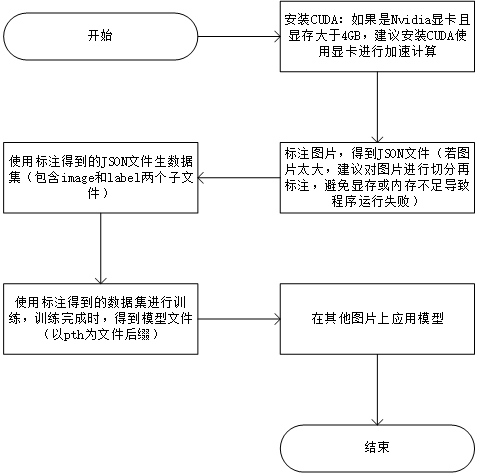

# Unet的GUI图像分割

##  1、简介

1. 本程序使用`Python`进行开发，涉及到的主要`Python`库有`PyQT5`、`opencv-python`、`PyTorch`、`numpy`、`labelme`、`Pillow`、`PySide2`。

2. 本程序可以自行使用`labelme`对图像进行标注，生成你自己的数据集，在你自己的数据集上进行训练，得到训练后的模型，你可以通过在可视化界面`GUI`上完成这上面的所有操作。

3. 软件使用[Adam](https://www.jiqizhixin.com/graph/technologies/f41c192d-9c93-4306-8c47-ce4bf10030dd)(Adaptive moment estimation)作为优化器，使用[BCEWithLogitsLoss](https://blog.csdn.net/xiaohuihui1994/article/details/93049975?utm_medium=distribute.pc_relevant.none-task-blog-searchFromBaidu-1.control&depth_1-utm_source=distribute.pc_relevant.none-task-blog-searchFromBaidu-1.control)作为损失函数

4. 使用本程序的工作流程大致如下：

   

## 2、安装CUDA

- 本程序建议使用GPU计算，GPU在深度学习上拥有CPU无法比拟的巨大优势
- 你可以使用软件的**检查是否可用GPU加速计算**，来检查你的电脑是否可用GPU，若显示`未检测到CUDA，无法进行GPU计算`，则您需要自行安装CUDA
  - 需要确保为Nvidia的显卡，并且支持[支持CUDA](https://developer.nvidia.com/cuda-gpus)，建议显存最低为4GB
  - 你可以到Nvidia官网下载
  - 你可以参考下面的[教程](https://blog.csdn.net/sinat_23619409/article/details/84202651)安装CUDA

## 3、切分图片

用较小的图片进行训练能避免训练失败；切分后的图片将按照序列进行排列，便于切分后的图片进行合并。

## 4、打开标注工具

打开开源软件`labelme`，进行图片的标注，得到`json`文件

# 5、用json生成数据集

把`labelme`标注生成的所有json文件放到统一文件夹，生成的数据集将包含两个文件夹，分别为`image`和`label`

## 6、训练

将数据集导入，选择训练轮数`epoch`以及`batch size`，对于`epoch`和`batch size`的介绍看下面的 [博文](https://blog.csdn.net/sinat_16643223/article/details/86670137)，如果你的显存或不够，建议的`batch size`是`1`，`epoch`可以根据需要精度修改；同时你还可以选择计算的方式，`CPU`或者`GPU`，GPU将拥有明显更快的速度，如果你的显卡是Nvidia的显卡，并且[支持CUDA](https://developer.nvidia.com/cuda-gpus)，且显存至少为4GB，建议使用`GPU`计算，但在使用`GPU`计算之前，需要安装`CUDA`，你可以在[这里](https://developer.nvidia.com/cuda-zone)安装`CUDA`。完成训练后，将得到一个以`pth`为后缀的模型文件，这个模型文件将在【模型应用】中使用

## 7、模型应用

使用【训练】得到的以`pth`为后缀的文件，对需要进行图像分割的图片应用模型。可以选择用GPU计算或者CPU计算；如果你的图片过大，可以将自动切分图片的选项切换为`是`，程序会对图片进行自动切分，创建临时文件夹，在被切分的图片上应用模型，完成后，将把被切分的图片合并为原图片。

## 8、添加比例尺

通过鼠标点击，获取比例尺的相关信息，你也可以自己输入比例尺

## 9、添加图片合并
添加图片，将添加的图片进行合并。计算出添加图片的最大长、宽，按照最大的长、宽创建网格，在网格中填充添加的图片。

